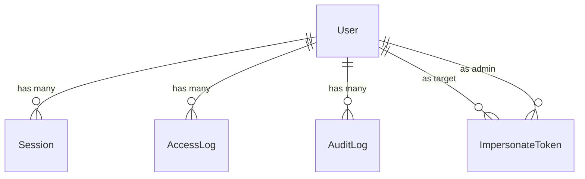
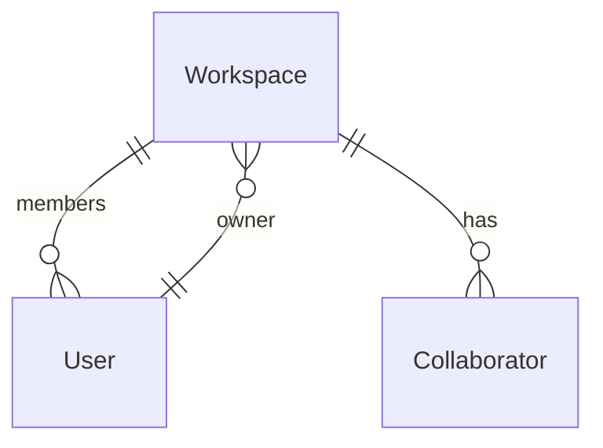
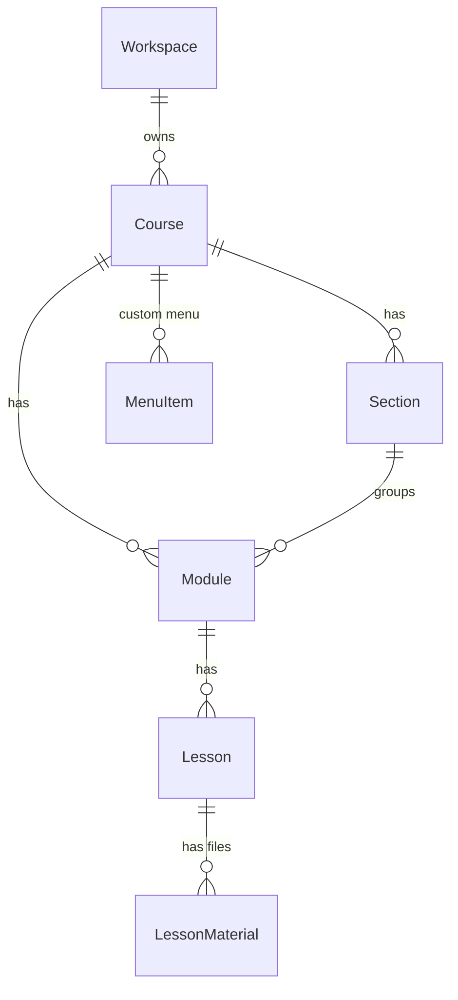
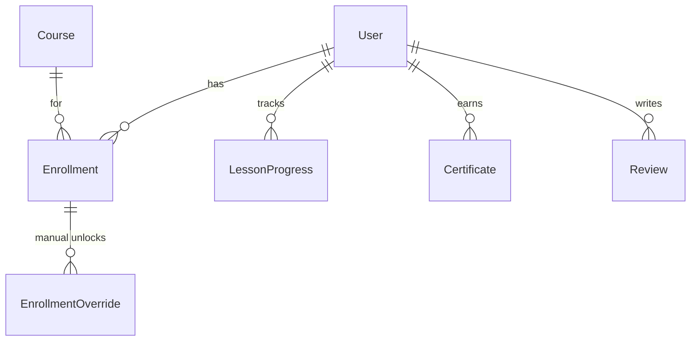
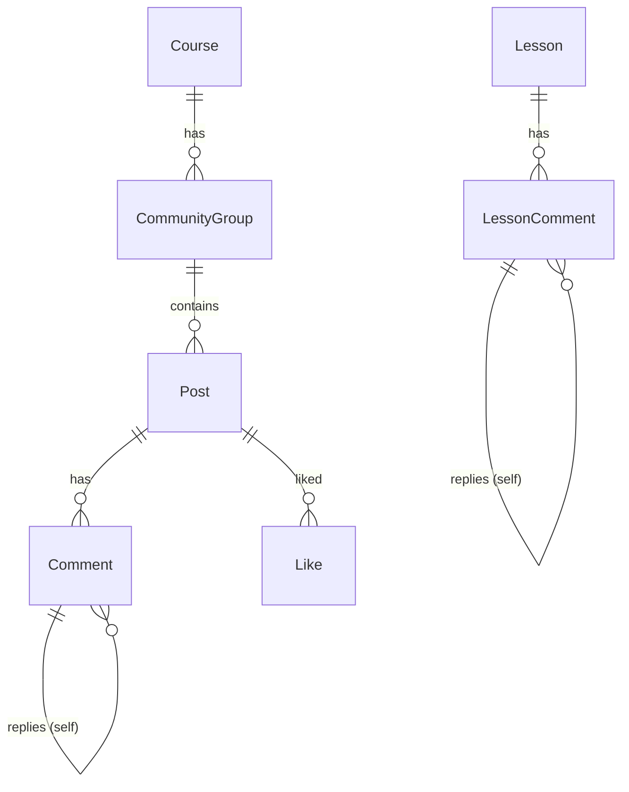
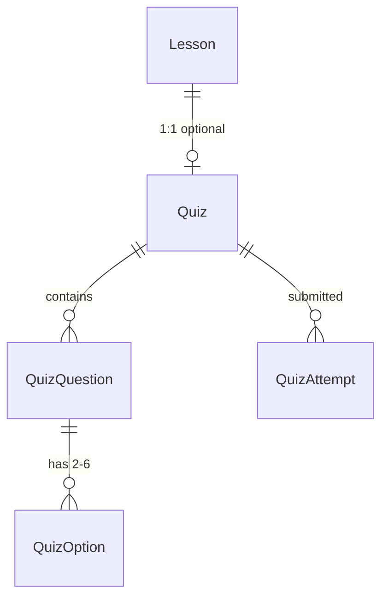
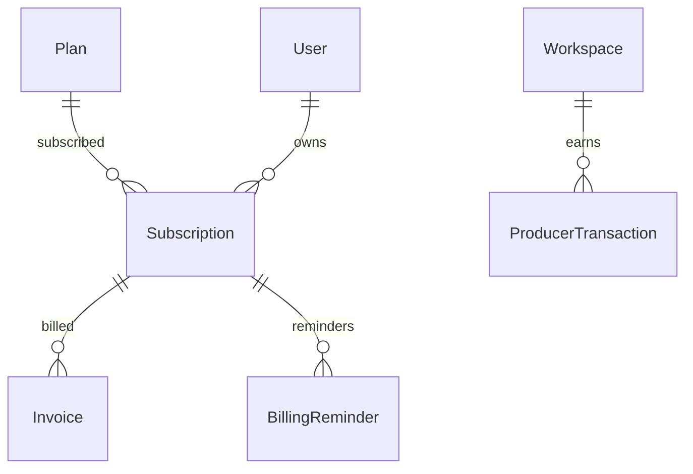

# Members Club — ERD (Entity Relationship Diagram)

> Modelo de dados completo — 51 models em 13 domínios.
> Última atualização: 06 de maio de 2026.

---

## Visão Geral

51 models organizados em 13 domínios. Cada seta → indica "belongs to" (FK), ← indica "has many".

**Convenções de IDs:**
- UUID v4: maioria dos models (User, Course, Module, Lesson, Enrollment, etc.)
- CUID: models mais recentes (LessonReaction, BillingReminder, Live, LiveMessage, etc.)
- String custom ("platform"): PlatformSettings (singleton)
- String key: Settings (key-value)

---

## 1. Identity & Access (5 models)

| Model | Campos-chave | Notas |
|-------|-------------|-------|
| **User** | id (PK), email (UK), role, points, level, document (encrypted CPF/CNPJ), workspaceId (FK), lastAccessAt, lastIpAddress | Hub central — relaciona com quase tudo |
| **Session** | id (PK), userId (FK), device, ip, expiresAt | Sessões ativas do usuário |
| **AccessLog** | id (PK), userId (FK), ip, userAgent, path | Histórico de IPs e acessos |
| **AuditLog** | id (PK), userId (FK), action, target, details | Trilha de auditoria |
| **ImpersonateToken** | id (PK), token (UK), userId (FK target), adminId (FK), expiresAt, used | Token one-time para admin acessar como producer |

**Cascade:** deletar User cascateia todas sessions/logs/tokens.

---

## 2. Workspace & RBAC (3 models)

| Model | Campos-chave | Notas |
|-------|-------------|-------|
| **Workspace** | id (PK), slug (UK), name, ownerId (FK), customDomain (UK), isActive, masterPassword | Container do producer — multi-tenant |
| **Collaborator** | id (PK), email, workspaceId (FK), userId (FK nullable), permissions[], courseIds[], status | Equipe do producer com permissões granulares |
| **AdminCollaborator** | id (PK), email (UK), userId (FK UK), permissions[], invitedById (FK), status | Equipe do admin da plataforma |

**Únicos:** Collaborator(workspaceId, email), AdminCollaborator.email, AdminCollaborator.userId (1:1 com User).

---

## 3. Course Content (6 models)

**Hierarquia:** Course → (Section?) → Module → Lesson → LessonMaterial

| Model | Campos-chave | Notas |
|-------|-------------|-------|
| **Course** | id (PK), slug (UK), title, workspaceId (FK), ownerId (FK), externalProductId (UK), isPublished, feature flags (certificate/community/gamification enabled) | Curso com configurações granulares |
| **Section** | id (PK), title, order, courseId (FK) | Agrupamento visual de módulos (opcional) |
| **Module** | id (PK), title, order, daysToRelease, releaseAt, courseId (FK), sectionId (FK optional) | Pode ter drip (liberação programada) |
| **Lesson** | id (PK), title, videoUrl, duration, order, daysToRelease, moduleId (FK) | Aula com vídeo YouTube/Vimeo |
| **LessonMaterial** | id (PK), lessonId (FK), fileUrl, fileType, fileSize, sortOrder | PDFs e anexos |
| **MenuItem** | id (PK), courseId (FK), label, icon, url, isDefault, enabled | Menu customizável do curso |

**Cascade:** Workspace → Course → Section/Module/Lesson/LessonMaterial/MenuItem. Section deletada → Module.sectionId vira null (SetNull).

---

## 4. Student Engagement (8 models)

**Únicos críticos (regras de negócio):**
- Enrollment(userId, courseId) — uma matrícula por curso
- LessonProgress(userId, lessonId) — um progresso por aula
- LessonReaction(userId, lessonId) — uma reação por aula
- Certificate(userId, courseId) — um certificado por conclusão
- Review(userId, courseId) — um review por aluno
- EnrollmentOverride(enrollmentId, moduleId) e (enrollmentId, lessonId) — uma override por escopo

| Model | Campos-chave | Notas |
|-------|-------------|-------|
| **Enrollment** | id, userId (FK), courseId (FK), status, expiresAt, termsAcceptedAt | Matrícula com expiração opcional |
| **EnrollmentOverride** | id, enrollmentId (FK), moduleId, lessonId, released | Liberação manual por aluno |
| **LessonProgress** | id, userId (FK), lessonId (FK), completed, completedAt | Progresso individual |
| **LessonReaction** | id, userId (FK), lessonId (FK), type (LIKE/DISLIKE) | Feedback do aluno |
| **Certificate** | id, code (UK), userId (FK), courseId (FK) | Certificado com código verificável |
| **Review** | id, userId (FK), courseId (FK), rating, comment | Avaliação do curso |
| **Tag** | id, workspaceId (FK), name, color, autoSource | Tags para segmentação |
| **UserTag** | id, userId (FK), tagId (FK) | Associação user-tag |

---

## 5. Community (5 models)

**2 sistemas de comentários distintos:**
- Comment → Post (comunidade)
- LessonComment → Lesson (aulas)
- Ambos suportam threading via parentId self-relation

| Model | Campos-chave |
|-------|-------------|
| **CommunityGroup** | id, courseId (FK), slug, name, isDefault, permission, order |
| **Post** | id, content, type (QUESTION/RESULT/FEEDBACK/FREE), pinned, userId (FK), courseId (FK), groupId (FK), status |
| **Comment** | id, content, userId (FK), postId (FK), parentId (FK self), status |
| **Like** | id, userId (FK), postId (FK) |
| **LessonComment** | id, content, userId (FK), lessonId (FK), parentId (FK self), status |

---

## 6. Quiz & Assessment (4 models)

| Model | Campos-chave | Notas |
|-------|-------------|-------|
| **Quiz** | id, lessonId (FK UK), title, passingScore, showAnswers | 1:1 com Lesson |
| **QuizQuestion** | id, quizId (FK), text, sortOrder | Pergunta de múltipla escolha |
| **QuizOption** | id, questionId (FK), text, isCorrect, sortOrder | 2-6 opções, exatamente 1 correta |
| **QuizAttempt** | id, quizId (FK), userId (FK), score, passed, answers (JSON) | Tentativa do aluno |

---

## 7. Lives & Realtime (4 models)

| Model | Campos-chave | Notas |
|-------|-------------|-------|
| **Live** | id, title, platform, externalUrl, embedUrl, status, scheduledAt, visibility, workspaceId (FK), courseId (FK optional) | Suporta Google Meet, Zoom, YouTube Live, Custom |
| **LiveMessage** | id, content, liveId (FK), userId (FK) | Chat da live |
| **LiveModerator** | id, liveId (FK), userId (FK) | Único: (liveId, userId) |
| **LiveNotification** | id, liveId (FK), userId (FK), type, read | Aviso de live agendada/iniciada |

---

## 8. Notifications & PWA (2 models)

| Model | Campos-chave |
|-------|-------------|
| **Notification** | id, userId (FK), type (9 tipos), message, link, read |
| **PushSubscription** | id, userId (FK), endpoint, p256dh, auth, device |

**Único:** PushSubscription(userId, endpoint) — user pode ter vários devices.

---

## 9. Billing (5 models)

**2 fluxos financeiros distintos:**
- **Plataforma → Producer:** Plan + Subscription + Invoice (assinatura mensal R$97)
- **Producer → Aluno:** ProducerTransaction (pagamentos dos alunos via webhooks Applyfy/Stripe)

| Model | Campos-chave | Notas |
|-------|-------------|-------|
| **Plan** | id, slug (UK), name, price, currency, interval, maxWorkspaces, maxCoursesPerWorkspace, active | Planos da plataforma |
| **Subscription** | id, userId (FK), planId (FK), status, currentPeriodStart/End, externalId (UK), exempt | Assinatura do producer |
| **Invoice** | id, subscriptionId (FK), amount, status, externalId (UK), paidAt | Fatura mensal |
| **BillingReminder** | id, subscriptionId (FK), type, sentAt | Único: (subscriptionId, type) |
| **ProducerTransaction** | id, workspaceId (FK), status, amount, externalId (UK), customerEmail | Pagamento do aluno |

---

## 10. Webhooks & Integrations (2 models)

| Model | Campos-chave | Notas |
|-------|-------------|-------|
| **WebhookLog** | id, event, email, productExternalId, courseId, workspaceId (FK optional), status, errorMessage, rawPayload | Log de todos os webhooks recebidos |
| **IntegrationRequest** | id, gateway, email, notes, status | Stand-alone — pedidos de integração |

---

## 11. Automations (3 models)

| Model | Campos-chave | Notas |
|-------|-------------|-------|
| **Automation** | id, workspaceId (FK), courseId, name, active, triggerType (11 tipos), triggerConfig (JSON), actionType (5 tipos), actionConfig (JSON), executionCount | Motor de automações |
| **AutomationLog** | id, automationId (FK), userId, status, details | Auditoria de execuções |
| **PendingExecution** | id, automationId (FK), userId (FK), triggerData (JSON), executeAt, status | Fila do cron /api/cron/pending |

---

## 12. Support (2 models)

| Model | Campos-chave | Notas |
|-------|-------------|-------|
| **SupportTicket** | id, subject, status, priority, producerId (FK), assignedToId (FK optional), lastMessageAt, lastReadByAdmin/Producer | Ticket de suporte |
| **TicketMessage** | id, body, attachments[], ticketId (FK), senderId (FK) | Thread de mensagens |

---

## 13. Platform Settings (2 models)

| Model | Campos-chave | Notas |
|-------|-------------|-------|
| **Settings** | key (PK), value | Key-value flexível (applyfy_token, etc.) |
| **PlatformSettings** | id (PK "platform"), logoUrl, faviconUrl | Singleton — logo/favicon globais |

---

## Mapa de Cascades

| Origem | Destinos Cascade | Destinos SetNull |
|--------|-----------------|------------------|
| **User delete** | sessions, posts, comments, lessonComments, likes, reactions, certificates, reviews, enrollments, progress, quizAttempts, userTags, liveMessages, notifications, pushSubscriptions, moderations, pendingExecutions, tokens, logs, tickets | workspace (member), assignedTickets, Collaborator.user, Course.owner |
| **Workspace delete** | courses, webhookLogs, collaborators, transactions, automations, tags, lives | User.workspaceId (null) |
| **Course delete** | modules, sections, enrollments, posts, certificates, reviews, menuItems, lives, communityGroups | — |
| **Module delete** | lessons | — |
| **Section delete** | — | module.sectionId (null) |
| **Lesson delete** | progress, comments, materials, reactions, quiz | — |
| **Quiz delete** | questions, attempts | — |
| **Subscription delete** | invoices, billingReminders | — |
| **Live delete** | messages, notifications, moderators | — |
| **Automation delete** | logs, pendingExecutions | — |

---

## Índices Críticos para Performance

| Índice | Uso |
|--------|-----|
| Enrollment(courseId, status) | Listagem de alunos ativos por curso |
| LessonProgress(userId, lastAccessedAt) | "Continuar assistindo" |
| Post(courseId, status, createdAt) | Feed da comunidade |
| Comment(postId, status, createdAt) | Thread de comentários |
| Notification(userId, read, createdAt) | Bell + filtros |
| Subscription(currentPeriodEnd) | Cron billing |
| PendingExecution(status, executeAt) | Cron automations |
| Module(courseId, order) + Lesson(moduleId, order) | Ordenação rápida |
| AccessLog(userId, createdAt) | IP/audit history |

---

## Campos com Semântica Não-Óbvia

| Model.campo | Significado |
|-------------|------------|
| User.document | CPF/CNPJ encriptado AES-256 com ENCRYPTION_SECRET |
| User.themeConfig | JSON serializado das cores do tema do produtor |
| Workspace.masterPassword | Senha mestre opcional para login do workspace |
| Course.externalProductId | Chave de matching com Applyfy/Stripe (unique) |
| Course.memberLayoutStyle | netflix, grid, etc. |
| Live.savedAsLessonId | Refs a lesson criada após live ENDED com gravação |
| Subscription.exempt | Producer não paga (cortesia/parceria) |
| Automation.triggerConfig/actionConfig | JSON serializado |
| QuizAttempt.answers | JSON serializado das respostas do aluno |
| PlatformSettings.id | Sempre "platform" (singleton enforced) |
